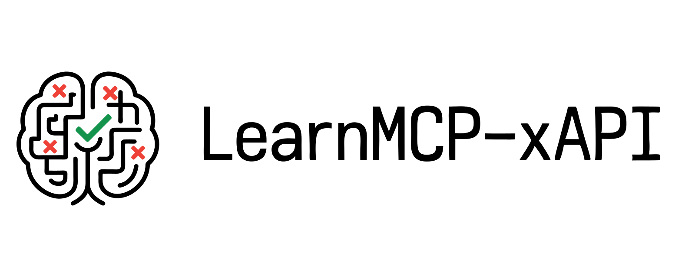

<p align="center">
  <a href="https://github.com/DavidLMS/learnmcp-xapi/pulls">
    
  </a>
  <a href="LICENSE">
      
    </a>
</p>

# LearnMCP-xAPI

LearnMCP-xAPI is an open-source MCP (Model Context Protocol) server that enables AI agents to record and retrieve learning activities through xAPI-compliant Learning Record Stores. Unlike traditional educational AI tools that focus on content generation or automated grading, LearnMCP-xAPI creates a bridge between AI interactions and learning analytics, allowing intelligent systems to build contextual understanding of what learners know, practice, and achieve.

This project addresses a fundamental gap in AI-powered education: the ability for AI agents to maintain persistent, structured records of learning progress that can inform future interactions and provide evidence of skill development. Whether you're building AI tutoring systems, personalized learning assistants, or educational analytics platforms, LearnMCP-xAPI provides the infrastructure to make AI interactions learning-aware.

> **Important Note:** LearnMCP-xAPI is designed as a foundational component for educational technology systems. It enables AI agents to participate meaningfully in the learning process by maintaining awareness of student progress, but it does not replace thoughtful pedagogical design or human educational expertise.

<p align="center">
    <a href="https://github.com/DavidLMS/learnmcp-xapi/issues/new?assignees=&labels=bug&projects=&template=bug_report.md&title=%5BBUG%5D">Report Bug</a>
    ·
    <a href="https://github.com/DavidLMS/learnmcp-xapi/issues/new?assignees=&labels=enhancement&projects=&template=feature_request.md&title=%5BREQUEST%5D">Request Feature</a>
    ·
    <a href="https://github.com/DavidLMS/learnmcp-xapi/wiki">Wiki</a>
  </p>

## Table of Contents

[Motivation](#motivation)

[How LearnMCP-xAPI Works](#how-learnmcp-xapi-works)

[Key Features](#key-features)

[Architecture Overview](#architecture-overview)

[Getting Started](#getting-started)

[Integration Guides](#integration-guides)

[License](#license)

[Contributing](#contributing)

## Motivation

The current landscape of AI in education is dominated by familiar patterns: pre-made prompts, automated content generation, and the eternal struggle between students wanting AI to do their work and teachers trying to prevent exactly that. This approach treats AI as either a shortcut or an obstacle, missing the transformative potential of intelligent systems that can genuinely support learning.

The inspiration for LearnMCP-xAPI came from observing this fundamental disconnect. Most educational AI tools operate in isolation—they generate responses, create activities, or analyze text, but they don't learn from or contribute to a student's ongoing educational journey. There's no memory of what a student has practiced, struggled with, or mastered. Each interaction starts from zero.

Learning Record Stores (LRS) and the xAPI specification have long provided a solution for capturing and analyzing learning activities, but they've remained largely disconnected from the AI systems that are increasingly central to educational experiences. LearnMCP-xAPI bridges this gap by enabling AI agents to both contribute to and learn from comprehensive learning records.

This approach opens possibilities that go far beyond traditional AI tutoring:

- **Adaptive AI Companions**: AI assistants that adjust their explanations based on what a student has previously learned and where they've struggled.
- **Evidence-Based Assessment**: Teachers can gather authentic evidence of learning from natural AI interactions rather than artificial testing scenarios.
- **Personalized Learning Pathways**: AI systems that recommend next steps based on comprehensive learning histories.
- **Cross-Platform Learning Continuity**: Students' learning progress follows them across different AI-powered educational tools.

The goal isn't to replace human teachers or traditional learning methods, but to create AI systems that can meaningfully participate in the learning process—understanding context, building on prior knowledge, and contributing to a richer, more personalized educational experience.

## How LearnMCP-xAPI Works

LearnMCP-xAPI implements the Model Context Protocol (MCP) to create a seamless connection between AI agents and learning analytics infrastructure. The system operates as a bridge, translating natural language learning interactions into structured xAPI statements while providing AI agents with contextual awareness of student progress.

1. **AI Agent Integration**: Through MCP, AI agents gain access to three core learning tools: statement recording, progress retrieval, and activity vocabulary management.

2. **Natural Language Processing**: LearnMCP-xAPI enables two complementary approaches to learning activity capture:
   - **Explicit Learning Activities**: When students directly mention their learning—"I practiced Python loops today" or "I'm struggling with quadratic equations"—the AI agent converts these into structured statements.
   - **Implicit Learning Evidence**: AI agents can analyze conversations to identify demonstrated knowledge or gaps, automatically recording evidence like "Student successfully explained recursion concepts" or "Student showed confusion with database joins" based on the natural flow of educational dialogue.

3. **xAPI Statement Generation**: LearnMCP-xAPI transforms learning activities into xAPI-compliant statements that include the learner (actor), the activity (verb + object), context, and results. These statements conform to educational data standards and can include scores, completion status, and additional metadata.

4. **Learning Record Store Integration**: Statements are securely stored in any xAPI 1.0.3 compliant LRS. The system handles authentication, validation, and error recovery automatically.

5. **Contextual Retrieval**: AI agents can query learning histories to understand what students have practiced, achieved, or struggled with. This enables responses that build on prior knowledge and address individual learning needs.

6. **Privacy-Preserving Design**: Each student receives a unique identifier (ACTOR_UUID) that separates their learning records while maintaining privacy. No personal information is stored—only learning activities and progress indicators.

This architecture enables AI systems to participate in the complete learning cycle: they can understand where students are coming from, contribute meaningful educational interactions, and build evidence of learning progress that benefits both students and educators.

## Key Features

- **xAPI 1.0.3 Compliance**: Full compatibility with the xAPI specification ensures interoperability with existing educational technology ecosystems,
- **MCP Integration**: Native support for the Model Context Protocol enables seamless AI agent connectivity.
- **Universal LRS Support**: Works with any xAPI-compliant Learning Record Store, from lightweight SQLite solutions to enterprise platforms.
- **Privacy by Design**: Student identifiers are configurable and separate from personal information, ensuring educational data privacy.
- **Intelligent Statement Generation**: Automatically converts natural language learning activities into structured xAPI statements with appropriate scoring and context.
- **Contextual Learning Queries**: AI agents can retrieve filtered learning histories to understand student progress and adapt their responses.
- **Retry Logic and Error Handling**: Robust network handling ensures reliable communication with Learning Record Stores.
- **Educational Vocabulary Management**: Built-in support for common learning verbs (practiced, mastered, experienced, achieved) with extensible architecture.
- **Multi-Student Support**: Simple configuration enables deployment across classrooms, institutions, or individual learners.
- **Real-Time Learning Analytics**: Immediate availability of learning data for adaptive AI responses and educational insights.

## Architecture Overview

LearnMCP-xAPI follows a modular architecture designed for educational technology integration.

**Core Components:**

- **MCP Tools Layer**: Exposes learning functionality to AI agents through standardized MCP protocol.
- **xAPI Statement Engine**: Converts learning activities into compliant xAPI statements with proper validation.
- **LRS Client**: Handles authentication, communication, and error recovery with Learning Record Stores.
- **Privacy Management**: Ensures secure handling of student identifiers and learning data.
- **Configuration System**: Flexible environment-based setup for different deployment scenarios.

## Getting Started

### Prerequisites

Before starting, ensure you have:
- Python 3.8 or higher
- Access to an xAPI-compliant Learning Record Store (we recommend [LRS SQL](https://github.com/yetanalytics/lrsql) for development)
- An MCP-compatible client (such as Claude Desktop)

### Installation

#### Option 1: Install from source

```bash
# Clone the repository
git clone https://github.com/DavidLMS/learnmcp-xapi.git
cd learnmcp-xapi

# Install dependencies
pip install -r requirements.txt
```

#### Option 2: Install with venv

```bash
# Clone the repository
git clone https://github.com/DavidLMS/learnmcp-xapi.git
cd learnmcp-xapi

# Create and activate a virtual environment
python -m venv learnmcp-env
source learnmcp-env/bin/activate  # On Windows: learnmcp-env\Scripts\activate

# Install dependencies
pip install -r requirements.txt
```

#### Option 3: Install with uv

```bash
# Install uv if you don't have it
pip install uv

# Clone the repository
git clone https://github.com/DavidLMS/learnmcp-xapi.git
cd learnmcp-xapi

# Create and activate a virtual environment
uv venv
source .venv/bin/activate  # On Windows: .venv\Scripts\activate

# Install dependencies
uv pip install -r requirements.txt
```

#### Option 4: Use Docker

```bash
# Clone the repository
git clone https://github.com/DavidLMS/learnmcp-xapi.git
cd learnmcp-xapi

# Build the Docker image
docker build -t learnmcp-xapi:1.0 .

# Run with environment variables
docker run -p 8000:8000 \
  -e LRS_ENDPOINT=http://localhost:8080 \
  -e LRS_KEY=your-lrs-key \
  -e LRS_SECRET=your-lrs-secret \
  -e ACTOR_UUID=student-unique-id-here \
  learnmcp-xapi:1.0
```

### Configuration

Copy the example configuration file and customize it for your setup:

```bash
cp .env.example .env
```
Edit the `.env` file with your specific LRS settings and student identifier. See `.env.example` for all available configuration options.

### Quick Test

```bash
# Start the MCP server
python -m learnmcp_xapi.main

# Check health endpoint
curl http://localhost:8000/health
```

You should see a response indicating the server is healthy and connected to your LRS.

## Integration Guides

LearnMCP-xAPI is designed to work with various Learning Record Stores and AI clients. Detailed setup guides are available in our Wiki:

### Learning Record Store Integration
- **[LRS SQL Setup](https://github.com/DavidLMS/learnmcp-xapi/wiki/LRS-Integrations/LRSQL-Setup)** - Complete guide for setting up LRSQL as your development LRS
- More LRS integrations coming soon...

### AI Client Integration
- **[Claude Desktop Setup](https://github.com/DavidLMS/learnmcp-xapi/wiki/MCP-Client-Integrations/Claude-Desktop-Setup)** - Step-by-step guide for connecting Claude Desktop as your AI learning companion
- More client integrations coming soon...

## Future Development

LearnMCP-xAPI is under active development with planned improvements including:

- **Expanded Integration Testing**: Comprehensive compatibility testing and setup guides for additional Learning Record Stores and MCP clients.
- **Live Demo Environment**: Interactive demonstration platform where users can test LearnMCP-xAPI functionality without local setup.
- **Educational Assessment Templates**: Pre-built system prompts that enable AI agents to record learning evidence according to specific curriculum standards, evaluation criteria, and educational legislation requirements.
- **Interchangeable Learning Profiles**: Dynamic profile system where AI agents can retrieve assessment criteria and recording formats directly from the MCP server, eliminating the need for manual prompt configuration.

## License

LearnMCP-xAPI is released under the [MIT License](https://github.com/DavidLMS/learnmcp-xapi/blob/main/LICENSE). You are free to use, modify, and distribute the code for both commercial and non-commercial purposes.

## Contributing

Contributions to LearnMCP-xAPI are welcome! Whether you're improving the code, enhancing the documentation, or suggesting new features, your input is valuable. Please check out the [CONTRIBUTING.md](https://github.com/DavidLMS/learnmcp-xapi/blob/main/CONTRIBUTING.md) file for guidelines on how to get started and make your contributions count.

We're particularly interested in:
- Additional LRS integrations and compatibility testing
- New MCP client implementations and examples
- Educational use case studies and best practices
- Performance optimizations and security enhancements
